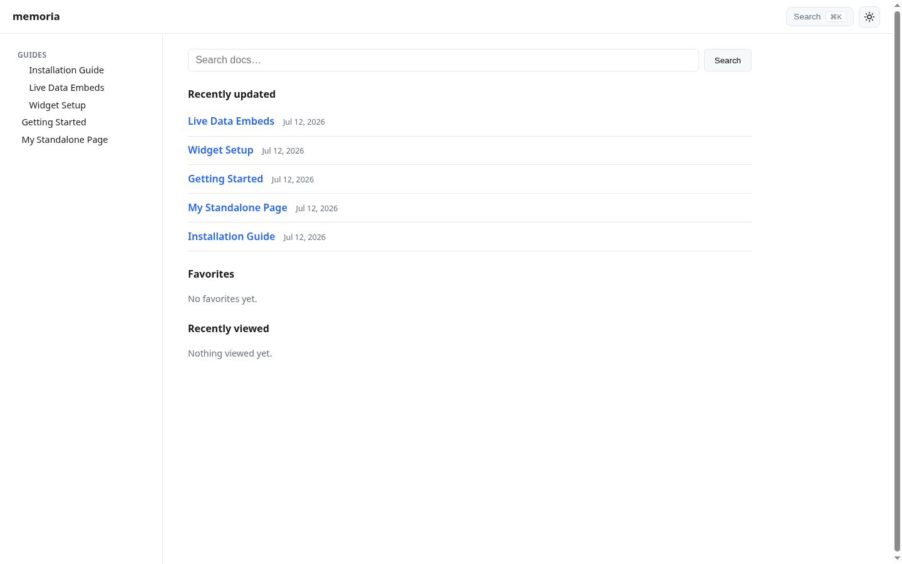
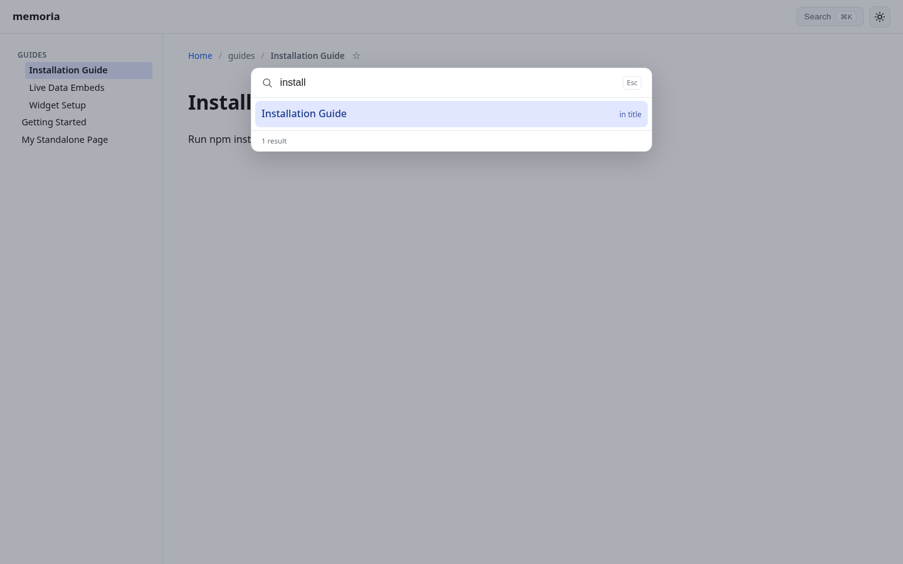
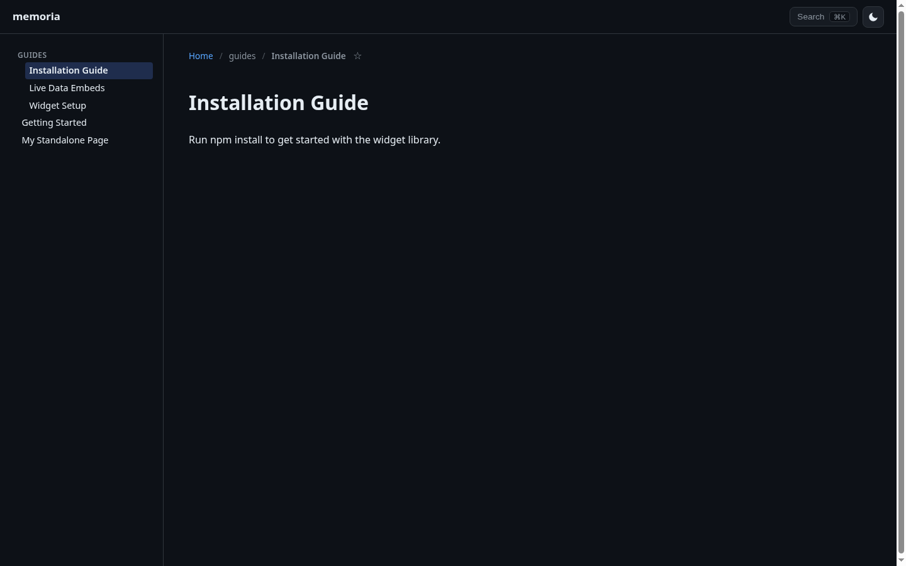
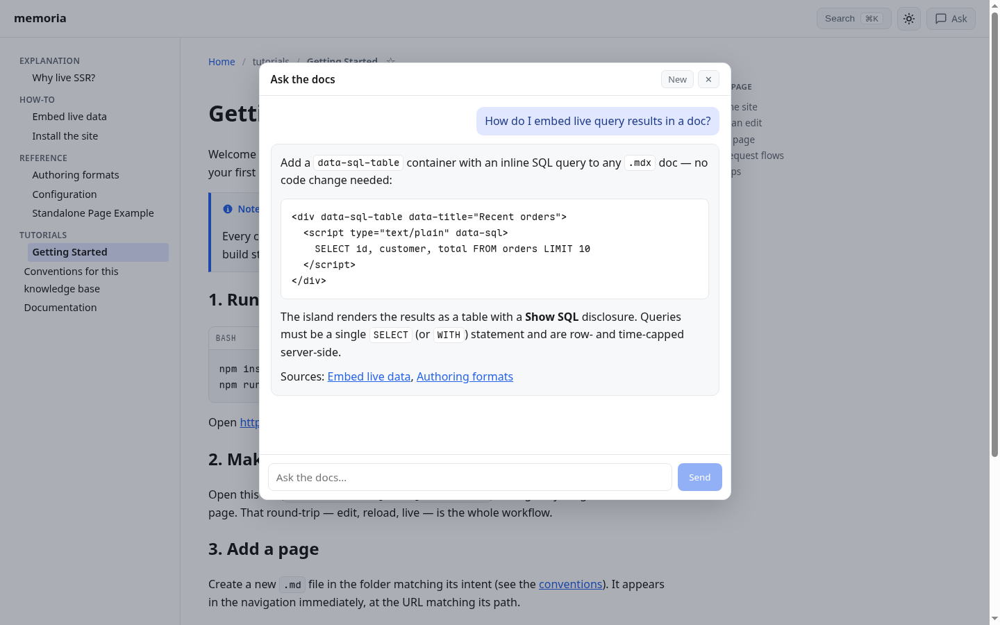

# Memoria — live-SSR docs site

Turn a folder of markdown into a searchable, live, optionally AI-queryable docs
site — with **zero rebuild** between editing a doc and seeing it live.

## Demo

Edit a markdown file, reload the page, and the change is live — no build, no
deploy:

[▶ Watch the live-SSR demo](.github/demo-live-ssr.webm)

## TL;DR

- **Zero-build.** Docs render at request time — edit a file, refresh, it's
  live. No compile step in dev or prod.
- **Push-to-publish via webhook.** Content syncs from your git repo at
  runtime; a signed push webhook refreshes it with no redeploy. The container
  image ships no content, so one image serves any team's docs.
- **Live data embedded in docs.** Author a `data-sql-table` block in markdown
  and get a live, guarded query results table — no code change.
- **AI chat grounded in your docs.** Optional "ask the docs" agent streams
  answers that cite the pages it actually read.
- **Batteries included, nothing required.** Full-text search (no external
  service), ⌘K palette, dark mode, mermaid, callouts — and every optional
  feature turns off cleanly when unconfigured.
- **Flexible, not lock-in.** Your content is just markdown in your git repo and
  the site is driven by env vars — no proprietary format, no plugin API to
  learn, no build pipeline to fight. It bends to how you already work and
  evolves with your needs, instead of forcing your docs into one tool's fixed
  behavior.

## Why use this?

Most docs tooling (Docusaurus, VitePress, MkDocs…) compiles content at build
time. That creates three costs that make docs rot:

- **Edit latency.** Every typo fix means rebuild → redeploy → wait. When
  publishing a change takes minutes of CI, people stop making small fixes.
- **Coupling.** Content is baked into the artifact. Docs and deploys are welded
  together, so the team that writes docs depends on the team that ships code.
- **Lock-in.** The structure, authoring model, and feature set are the tool's,
  not yours. Adopting one is a commitment to its conventions; changing how your
  docs work later means migrating off it, and leaving means an export-and-port
  project.

Memoria renders docs **at request time** and syncs them **from git at
runtime** — and stays deliberately un-opinionated about everything else:

- Edit a file, refresh the page — the change is live. Locally *and* in
  production (a push to your docs repo refreshes content via webhook, no
  deploy).
- The deployable image contains **no content**. One prebuilt image serves any
  team's docs — adopting it is configuration, not a codebase.
- Writers only ever touch markdown. Adding a page, a cross-link, a mermaid
  diagram, or even a live SQL table is a docs edit, not a code change.
- Search, nav tree, dark mode, and recents/favorites work out of the box with
  no external services. AI "ask the docs" chat and live-data embeds are
  opt-in via a single env var each, and hide themselves when unconfigured.
- Nothing about your setup is load-bearing on Memoria. It imposes no folder
  layout, no metadata schema, no plugin system — so it evolves with your needs
  (reorganize folders, adopt a convention, flip on a feature) rather than
  locking you into one behavior. And because the content is just markdown in
  git, leaving is a no-op: your files are already portable to any other tool.

If your docs live next to your code and change often, this removes every step
between "I noticed a mistake" and "it's fixed for everyone."

| | |
| --- | --- |
|  |  |
| *Home: nav tree, recently updated, search* | *⌘K palette with live results* |
|  |  |
| *Dark mode (pre-paint, no flash)* | *AI chat: streamed answers citing the docs it read* |

## Get started

With Docker (no toolchain needed):

```bash
docker compose up
```

Or with Node ≥24:

```bash
npm install
npm run dev
```

Open http://localhost:4321 — the site serves the `docs/` folder. Edit a file,
reload, see the change.

Point it at your own docs:

```bash
DOCS_DIR=/path/to/your/docs npm run dev
```

That's it. No config files, no keys — optional features stay off until you
enable them (see [Configuration](#configuration)).

**Add a page:** drop a `.md` file anywhere under the docs folder. It's live at
the URL matching its path (`guides/setup.md` → `/docs/guides/setup`).

## Authoring

| You write | You get |
| --- | --- |
| `.md` | Rendered markdown (GFM), raw HTML stripped |
| `.mdx` | Markdown with raw HTML passthrough (basis for live-data embeds) |
| `.html` | A fragment in the site layout, or a verbatim full page with `standalone: true` frontmatter |
| `# Heading` | The page title (first H1 wins) |
| Relative links (`../foo.md`) | Rewritten to in-site routes when the target exists; external/anchor/unknown links left as authored |
| ` ```mermaid ` fences | Client-rendered, theme-aware diagrams |
| `> [!NOTE]` / `[!WARNING]` | Styled callouts |
| Code fences | Syntax highlighting + copy button |
| `<div data-sql-table>` with inline SQL (in `.mdx`) | A live results table (when a query engine is configured) |

Readers get a nav tree, breadcrumbs, a ⌘K search palette (with a no-JS `?q=`
fallback), light/dark theme, and per-reader recents/favorites — no per-doc
setup.

## Organizing your knowledge base

Memoria does not enforce any documentation structure — point it at any folder
of files and it renders what it finds: folders become the nav tree, relative
links become cross-references, frontmatter carries metadata. That said, if
you're starting a knowledge base from scratch, these optional conventions make
the same content work well for humans *and* AI agents (the built-in chat, or
any agent pointed at your docs repo). The bundled `docs/` sample follows them;
yours doesn't have to:

- **Plain markdown in git is the format.** No proprietary silo: the same files
  are readable by people, diffable in PRs, greppable by agents, and portable to
  any other tool. That's the "docs-as-code" principle.
- **One concept per doc, linked liberally.** Small, atomic pages with relative
  links between them (Zettelkasten style) beat sprawling mega-pages — for
  readers navigating and for retrieval, since search and `read_doc` both work
  page-at-a-time.
- **Organize by reader intent, not org chart.** The [Diátaxis](https://diataxis.fr)
  framework's four folders — `tutorials/`, `how-to/`, `reference/`,
  `explanation/` — map directly onto Memoria's nav tree and tell both a human
  and an agent what kind of answer a doc contains.
- **Stable, meaningful paths.** The URL is derived from the file path, so a
  predictable scheme (Diátaxis folders, or numbered
  [Johnny Decimal](https://johnnydecimal.com) categories) keeps links from
  rotting and gives agents a browsable taxonomy.
- **Frontmatter for metadata, H1 for the title.** Keep authoring metadata
  (`title:`, `standalone:`, tags) in frontmatter — Memoria strips it from the
  rendered page but tools can index it. The first `# H1` is the single source
  of truth for the title.
- **Give agents an entry point.** A top-level index/overview doc (the spirit of
  [llms.txt](https://llmstxt.org)) that lists what lives where dramatically
  improves agent navigation; an [AGENTS.md](https://agents.md) in the docs repo
  can state the conventions themselves.

Commonly used documentation structures, any of which work here:

- [Diátaxis](https://diataxis.fr) — four categories by reader intent
  (tutorials, how-to, reference, explanation); the most widely adopted for
  product/developer docs.
- [The Documentation System (Divio)](https://docs.divio.com/documentation-system/)
  — Diátaxis's predecessor, same quadrants with its own framing.
- [The Good Docs Project](https://www.thegooddocsproject.dev) — ready-made
  templates per doc type (README, tutorial, API reference, ADR…).
- [Zettelkasten](https://zettelkasten.de/introduction/) — atomic,
  densely-linked notes; structure emerges from links rather than folders.
- [Johnny Decimal](https://johnnydecimal.com) — numbered categories
  (`10-19 …`, `11.02 …`) for predictable, stable locations.
- [Building a Second Brain](https://www.buildingasecondbrain.com) (Tiago
  Forte) — personal knowledge management with the
  [PARA method](https://fortelabs.com/blog/para/): Projects, Areas, Resources,
  Archives, organized by actionability.
- [arc42](https://arc42.org) — a fixed 12-section template for software
  architecture documentation.

Further reading: [Write the Docs: docs as code](https://www.writethedocs.org/guide/docs-as-code/) ·
[llms.txt spec](https://llmstxt.org) ·
[AGENTS.md](https://agents.md)

## Configuration

Everything is env vars; every feature degrades cleanly when unset. Copy
`.env.example` and fill in only what you need.

| Env var | Default | Enables |
| --- | --- | --- |
| `DOCS_DIR` | `./docs` | Content directory to serve |
| `DOCS_GIT_REPO` | unset | Runtime git sync (unset → read `DOCS_DIR` directly) |
| `DOCS_GIT_REF` | `main` | Tracked ref for sync |
| `DOCS_GIT_SUBTREE` | `docs` | Sparse-checkout subtree within the docs repo |
| `REPO_DIR` | `/data/repo` | Writable checkout volume |
| `WEBHOOK_SECRET` | unset | HMAC verification for `POST /api/github-webhook` |
| `GITHUB_APP_ID` / `GITHUB_APP_INSTALLATION_ID` / `GITHUB_APP_PRIVATE_KEY` | unset | Short-lived tokens for private docs repos |
| `OPENROUTER_API_KEY` | unset | "Ask the docs" AI chat (unset → trigger hidden) |
| `DOCS_AI_MODEL` | `anthropic/claude-3.5-haiku` | Chat model slug |
| `QUERY_ENGINE_URL` | unset | Live-data SQL embeds (unset → embeds report unavailable) |
| `QUERY_MAX_ROWS` | `200` | Row cap per SQL embed |
| `QUERY_TIMEOUT_MS` | `5000` | Per-query timeout for SQL embeds |
| `HOST` / `PORT` | `0.0.0.0` / `4321` | Server bind |
| `SHUTDOWN_GRACE_MS` | `10000` | Drain window on SIGTERM |

## Production

The image contains no content — one build serves anyone's docs via env alone:

```bash
npm run docker:build
docker run -p 4321:4321 \
  -e DOCS_GIT_REPO=https://github.com/your-org/your-docs \
  -e WEBHOOK_SECRET=change-me \
  -v docs-data:/data \
  memoria
```

On boot it shallow-clones your docs repo; a push to the tracked ref hits the
HMAC-verified webhook and refreshes content in place. Kubernetes manifests
(SSO-gated ingress with a public webhook path, probes, single-replica
rationale) and an idempotent webhook-registration script live in
[`deploy/`](deploy/README.md).

## Development

```bash
npm run verify   # type-check && lint && test && build
npm test         # vitest — pins the invariants below
```

The architecture is ports-and-adapters; each layer has a README stating its
rules: [`src/domain/`](src/domain/README.md) (pure doc resolution/search),
[`src/render/`](src/render/README.md) (request-time unified pipeline),
[`src/adapters/`](src/adapters/README.md) (git sync, AI, query engine — all
server-only, all optional), [`src/client/`](src/client/README.md) (no secrets),
`src/pages/` (thin entrypoints).

Invariants the test suite pins — don't weaken them to pass:

1. Doc reads are never cached (live editing depends on it).
2. One render code path for dev and prod.
3. Content is never baked into the image.
4. Secrets are server-side only.
5. Link rewriting only touches links to real docs.
6. Optional features degrade, never error — and a failed content sync never
   wipes the currently served content.

## License

[MIT](LICENSE)
