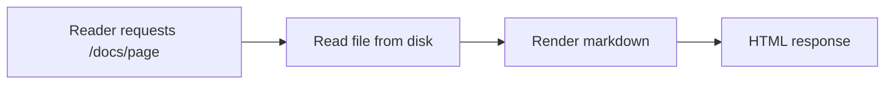

# Getting Started

Welcome to Memoria — a live SSR documentation site. This tutorial walks you
through your first edit.

> [!NOTE]
> Every change you make to a doc file is visible on the next page view.
> There is no build step.

## 1. Run the site

```bash
npm install
npm run dev
```

Open http://localhost:4321.

## 2. Make an edit

Open this file (`docs/tutorials/getting-started.md`), change anything, and
reload the page. That round-trip — edit, reload, live — is the whole workflow.

## 3. Add a page

Create a new `.md` file in the folder matching its intent (see the
[conventions](../AGENTS.md)). It appears in the navigation immediately, at the
URL matching its path.

## How a request flows



## Next steps

- [Install for production](../how-to/install.md)
- [Why live SSR?](../explanation/why-live-ssr.md)
