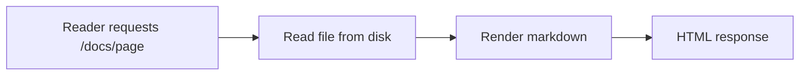

# Getting Started

Welcome to Memoria — a live SSR documentation site. This tutorial walks you
through your first edit.

> [!NOTE]
> Every change you make to a doc file is visible on the next page view.
> There is no build step.

## Prerequisites

- **Node 24 or newer** (`node -v` to check; the repo pins `24` in `.nvmrc`)
- **git**

## 1. Run the site

```bash
npm install
npm run dev
```

Open http://localhost:4321.

## 2. Make an edit

Open this file (`docs/tutorials/getting-started.md`) and change the top heading
from `# Getting Started` to `# Hello Memoria`. Save, then reload the page — the
heading and the browser tab title both update. No restart, no rebuild. That
round-trip — edit, reload, live — is the whole workflow.

## 3. Add a page

Create `docs/how-to/my-first-page.md` with a single line:

```markdown
# My First Page
```

Reload the site. The page appears in the navigation immediately and is live at
[/docs/how-to/my-first-page](/docs/how-to/my-first-page) — the path becomes the
URL. Pick the folder by reader intent (see the [conventions](../AGENTS.md)).

## How a request flows


```mermaid
flowchart LR
  A[Reader requests /docs/page] --> B[Read file from disk]
  B --> C[Render markdown]
  C --> D[HTML response]
```

## Next steps

- [Authoring formats](../reference/authoring-formats.md) — what you can put in a page
- [Install for production](../how-to/install.md)
- [Why live SSR?](../explanation/why-live-ssr.md)
